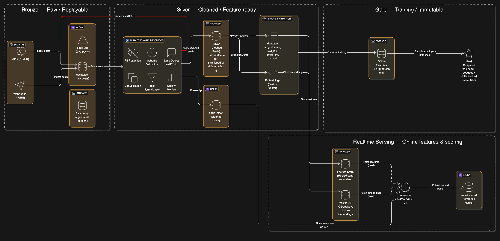
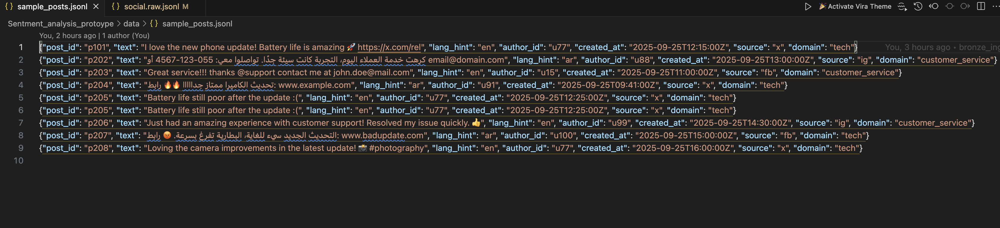
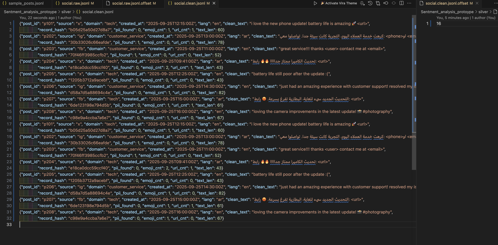
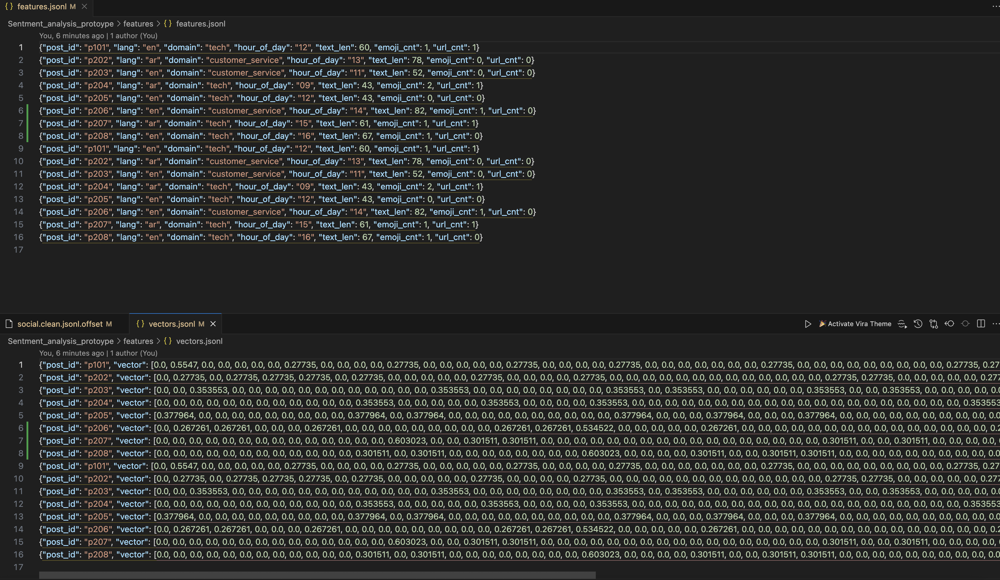
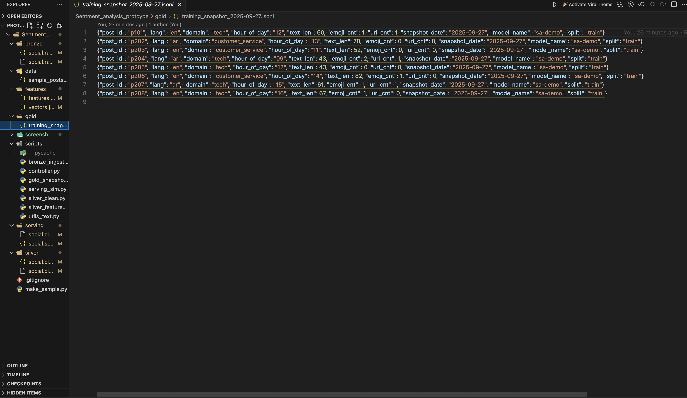
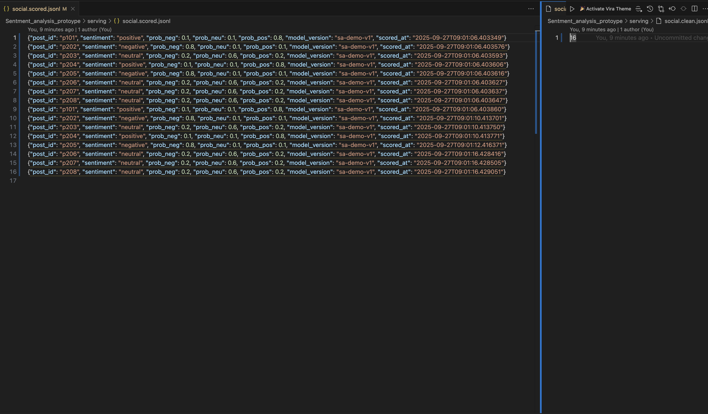

# Real-Time Social Media Sentiment Pipeline  

## Overview  
This project demonstrates a **data pipeline prototype** that prepares raw social media posts (Arabic/English) for:  
- **Model training** (historical datasets, offline feature store, gold snapshots).  
- **Real-time inference** (online feature store/vector DB, scoring service).  

---

## Architecture  

  

The pipeline follows a **Bronze → Silver → Gold + Realtime Serving** pattern:  

- **Bronze (Raw / Replayable)**  
  - Ingests posts from APIs and Webhooks.  
  - Stores into Kafka (`social.raw`) and optional object store dump.  
  - Bad events sent to DLQ (`social.dlq`).  

- **Silver (Cleaned / Feature-ready)**  
  - Flink Streaming Processor applies:  
    - PII redaction  
    - Schema validation  
    - Language detection  
    - Deduplication  
    - Text normalization  
    - Quality metrics  
  - Output stored in:  
    - Kafka topic (`social.clean`)  
    - Silver Parquet table (partitioned by dt/source/lang).  

- **Gold (Training / Immutable)**  
  - Feature extraction generates metadata + embeddings.  
  - Stored in offline Parquet/Iceberg.  
  - Periodic gold snapshot sampling → balanced, deduped, drift-checked dataset for model training.  

- **Realtime Serving (Online features & scoring)**  
  - Features in Redis/Feast (scalars) and Vector DB (Qdrant/pgvector).  
  - Inference service fetches features + embeddings, consumes posts, and publishes scored outputs to Kafka (`social.scored`).  

---

## Prototype  

The prototype simulates the architecture in **Python** with lightweight components:  

- **Bronze Layer:**  
  - `bronze_ingest.py` → loads `sample_posts.json` → produces into `social.raw.jsonl`.  
  - DLQ handling for malformed/null records.  

- **Silver Layer:**  
  - `silver_clean.py` → regex/heuristics for PII redaction, normalization, deduplication, lang detect.  
  - Output into `silver/social.clean.jsonl`.  
  - Metrics & offsets tracked for replayability.  

- **Feature Extraction:**  
  - `silver_features.py` → simple hashing vector + metadata (`lang, domain, len, emoji_cnt, url_cnt`).  
  - Stores:  
    - `features/features.jsonl` (metadata features).  
    - `features/vectors.jsonl` (embeddings).  

- **Gold Layer:**  
  - `gold_snapshot.py` → periodic (cron) sampling/deduplication → writes immutable snapshot into `gold/training_snapshot_<date>.json`.  

- **Realtime Serving Simulation:**  
  - `serving_sim.py` → consumes from `social.clean`, fetches features, applies a toy sentiment heuristic, and publishes to `serving/social.scored.jsonl`.  

- **Controller:**  
  - `controller.py` → orchestrates all scripts with subprocess.  

---

## Prototype Screenshots  

### Raw Ingest (Bronze)  
  

### Silver Cleaned Data & Offsets  
  

### Features & Vectors  
  

### Gold Snapshot  
  

### Running Controller  
  

### Serving & Scored Output  
  

---

## Quick Start  

### 1. Clone the repo  
```bash
git clone https://github.com/<your-org>/sentiment_pipeline_prototype.git
cd sentiment_pipeline_prototype
```

### 2. Run the pipeline controller
This orchestrates Bronze → Silver → Features → Serving.
```bash
python scripts/controller.py
```
You should see logs like:
```yaml
Produced to raw: p101
Cleaned: p101
Features extracted: p101
Scored: p101
```

### 3. Check the outputs

After running the controller, the pipeline will generate files at each stage. You can inspect them directly:  

- **Bronze (raw ingested posts):**  `bronze/social.raw.jsonl`  >> Contains the original posts exactly as ingested.  
- **Silver (cleaned posts):**  `silver/social.clean.jsonl` >> Posts after schema validation, PII redaction, normalization, deduplication, and language detection.  
- **Features (metadata + vectors):**  `features/features.jsonl`, `features/vectors.jsonl` >> Metadata features (language, domain, text length, emoji count, URL count) and hashed text embeddings.  
- **Serving (scored posts):**  `serving/social.scored.jsonl` >> Posts enriched with toy sentiment labels (positive/negative/neutral). 
- -**Gold Snapshot (for training):** `gold/training_snapshot_<date>.json` >> Immutable, balanced, deduplicated dataset sampled from Silver for model training.

### 4.Schedule gold snapshot 
To automate daily **Gold snapshot** creation, schedule `gold_snapshot.py` using cron (Linux/macOS) or Task Scheduler (Windows).  

Example cron job (runs every day at 02:00 server time):  
```bash
0 2 * * * cd /path/to/repo && python scripts/gold_snapshot.py >> logs/gold_snapshot.log 2>&1
```


---

## Strategic Discussion  

### Q1. How would you analyze the data and ensure quality for training?  
- **Validation:** enforce schema checks, PII detection, null filtering in Silver.  
- **Metrics:** track volume, deduplication %, language distribution, drift in features.  
- **Drift Checks:** compare feature distributions between current Silver vs past snapshots.  
- **Gold Snapshot Rules:** balanced across domains/lang, deduped by record hash, immutable storage for reproducibility.  

### Q2. How would you integrate with a feature store for training and inference?  
- **Offline Store (Parquet/Iceberg):**  
  - Historical features saved daily for training.  
  - Used to build gold snapshots.  

- **Online Store (Redis/Feast + Vector DB):**  
  - Scalars → Redis/Feast for fast lookups.  
  - Embeddings → Vector DB for similarity search.  
  - Inference service queries both in real time.  

This ensures **consistency** (same features for training & inference) and **low latency serving** for production AI workloads.  

---
